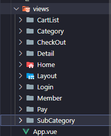
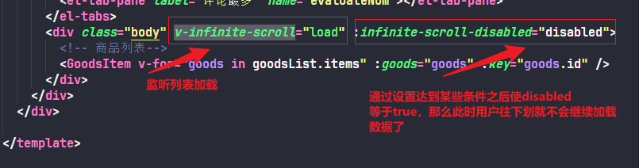
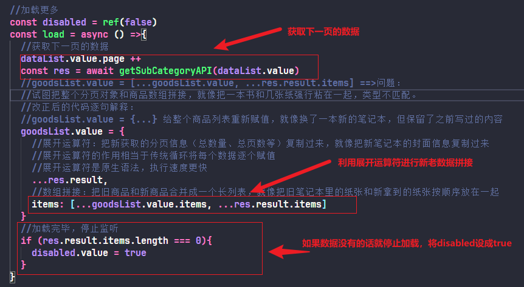

# 澜庭汇vue3+ts电商项目（本质上是小兔鲜电商项目）

### 🚀本项目本地部署与亮点总结

#### 1.部署步骤如下：

##### 1.拉取代码到本地

``` bash
git clone https://github.com/LIU2020822LMC/vue-LanTingHui-shopping-project.git
```

##### 2.进入项目文件夹安装依赖（需要自行下载安装node.js）

```bash
cd vue-LanTingHui-shopping-project
npm install
```

##### 3.启动项目

```bahs
npm run dev
```

##### 4.登录的账号与密码如下：

```bash
账号		     手机号       密码
heima282	12056258282	hm#qd@23!
heima283	12056258283	hm#qd@23!
heima284	12056258284	hm#qd@23!
heima285	12056258285	hm#qd@23!
heima286	12056258286	hm#qd@23!
heima287	12056258287	hm#qd@23!
heima288	12056258288	hm#qd@23!
heima289	12056258289	hm#qd@23!
heima290	12056258290	hm#qd@23!
heima291	12056258291	hm#qd@23!
heima292	12056258292	hm#qd@23!
heima293	12056258293	hm#qd@23!

沙箱新账号 fukuvb7569@sandbox.com			
登录和支付的密码还是111111			
```

#### 2.项目总结

##### 使用的技术栈有：**axios + vue3 + dayjs + element-plus + pinia + pinia-plugin-persistedstate + vue-router**

##### 1、基于业务的逻辑组件拆分思想

整个项目拆分成十个模块：购物车列表、商品分类、订单详情、商品详情、首页、整体布局、用户登录、会员中心、支付管理、热门商品信息


##### 2、长页面吸顶交互的实现

**使用原因：** 电商平台的页面大部分都很长，如果没有吸顶导航，用户将页面滑动到底部并且想要切换到其他页面时，只能再次将页面滑动到顶部，这种设计是很不友好的。有了吸顶导航后，用户可以随时点击吸顶导航进行页面切换。

**基本思想：** 浏览器在上下滑动的过程中，如果距离顶部的滚动距离大于某个值，就让固定的导航栏显示出来，小于这个值则隐藏。

未超过设定的距离顶部的值时显示的头部页面是这样子的：


超过了之后显示是这样子的：


**实现过程：**

准备LayoutFixed组件与LayoutHeader组件，这两个组件的模板差不多是一样的，不同的是，LayoutHeader组件是一直显示在顶部的，而LayoutFixed组件则在距离顶部的滚动距离大于设定某个值的时候才会显示出来，并且不会随着滑下去而被其他覆盖掉，就超过设置的距离之后就一直显示在顶部


LayoutFixed组件实现页面吸顶交互详情解释：

首先需要vueuse中的useScroll函数来获取你在页面距离顶部的滚动距离y


当y>78px的时候，添加show类名show类名里面有个opacity的属性


show类名里面有个opacity的属性，当这个属性变为1的时候，让这个组件显示出来


通过设置 “position: fixed;” 来实现，无论用户如何滚动页面，导航栏都一直显示在屏幕的特定位置。这样子就无论你往下滚动多少就一直显示在顶部


##### 3、自定义图片懒加载指令并封装为插件

**使用原因：** 电商平台项目有大量的商品图片, 同时加载和渲染全部的图片资源会挤占带宽, 首页白屏与加载时间过长,用户体验感不好, 同时还会浪费用户的流量，有些用户并不想全部看完，全部加载会耗费大量流量。所以需要使用到图片懒加载。将懒加载指令封装为插件是为了方便在项目各个组件中的使用。

**实现逻辑：** 
（1）懒加载：只有当图片出现在视口区域才会发送图片的网络请求，将图片的src替换成接口返回的图片地址。

（2）封装插件：使用app将指令封装成插件，然后再入口文件main.js文件中注册

**实现过程：**

通过useIntersectionObserver函数中isIntersecting属性判断图片是否进入视口区，如果达到标准则会向接口请求图片资源链接将其放在img中的src里


设置 rootMargin，提前80px开始加载图片


将指令注册为插件：在main.ts文件中引入图片懒加载指令所在文件（即@/directives/index），然后通过app实例注册为全局指令，这样子就可以在其他组件使用img-lazy这个指令了


在组件使用的时候需要写成v-img-lazy这样子的形式


##### 4、封装复用组件

**使用原因：** 在电商项目中，很多模块在结构上非常相似，只是内容不同，通过组件封装可以实现复用结构的效果。

**基本思想：** 把可复用的结构只写一次，把可能发生变化的部分抽象成组件参数（props/插槽）

比如说下面精选好货模块与人气推荐模块，他们机构都是相同的，只有数据是不一样的，所以只把相同的部分取出来，数据从父组件通过接口获取，然后再通过props传递给复用的组件，复用的组件再将他们渲染出来


基于上面的思想就创造出HomePanel组件作为复用的组件


下面是精选好货模块与人气推荐模块使用复用组件的方法


除了以上两个模块之外，还有一个HomeProduct组件也用到了这个复用组件


除了HomePanel组件时复用组件之外，还有一个GoodsItem组件也是复用组件，并且这个组件我将其全局注册（在main.ts文件进行全局注册），就是说，你在其他组件使用的时候直接<GoodsItem />就可以使用，不需要再import导入


以下是使用GoodsItem复用组件的例子

在src\views\Category\index.vue组件使用：


在src\views\Home\components\HomeProduct.vue组件使用：


在src\views\Member\components\userInfo.vue组件使用：


在src\views\SubCategory\index.vue组件使用：


##### 5、在package.json文件中的scripts的dev指令添加 --open

本来是"dev": "vite"改成"dev": "vite --open"，添加的作用是当你启动项目的时候，即命令行运行pnpm run dev或者npm run dev的时候，一旦加载完成会立刻打开默认浏览器打开网站


运行完毕之后不需要手动打开网址，直接自己打开


##### 6、通用逻辑函数的封装

**封装原因：** 在项目中通常会有一些通用的函数，比如小兔鲜项目中的轮播图部分，将重复使用的代码块封装成独立的函数，这样在需要时可以直接调用这些函数，避免了重复编写相同的代码，提高了代码的复用性‌，同时降低模块之间的耦合度。

**基本思想：** 将通用的逻辑函数拿出来封装到独立的js文件中，使用export将函数导出去，在函数内部使用return将需要用的数据或方法return出去

比如在src\views\Category\composables\useBanner.ts文件封装的轮播图相关逻辑函数


结合接口文档封装轮播图接口，配置相关的配置。 点击-->[轮播图接口地址](https://s.apifox.cn/c05cb8d7-e591-4d9c-aff8-11065a0ec1de/api-67132166)


接口所需要的参数以及地址


接口返回的数据，尤其是result里面的imgUrl数据，这个是关键，需要获取这个渲染到页面上实现轮播图的效果


在src\views\Category\index.vue组件中引入函数，并把要使用的数据和方法解构出来




使用element-plus里面提供的走马灯组件配合接口返回的图片数据实现轮播图效果


##### 7、列表无限加载

**使用原因：** 日常使用的电商平台的商品列表页中会有大量的商品内容，一般来说用户是很难滑倒列表的底部的，也就是说电商平台的商品列表一般是无限加载的。

**基本思想：** 监听用户是否划到了列表底部，是的话就请求新的商品数据，把新的商品数据和旧的商品数据拼接在一起渲染

使用elementPlus提供的v-infinite-scroll指令监听用户是否列表是否满足触底条件


结合elementPlus可以知道，v-infinite-scroll指令的意思是，当用户滚到底部的时候会触发load函数


在src\views\SubCategory\index.vue组件使用这个指令达到列表无限加载的效果



如果满足就让请求的页数参数加1获取下一页的数据，然后将新数据和老数据做拼接渲染，当没有数据可以获取时，就使用infinite-scroll-disabled指令禁止列表加载,也就是说，当用户没有往下划的时候就发送参数dataList.value.page=1就可以了，不用请求那么多次造成服务器负担，只有用户往下滑动时才会改变参数继续继续向后端发送请求获取数据




##### 8、路由缓存问题的处理

