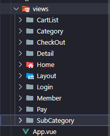
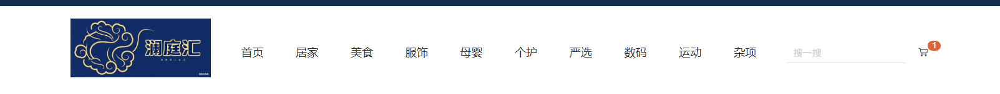
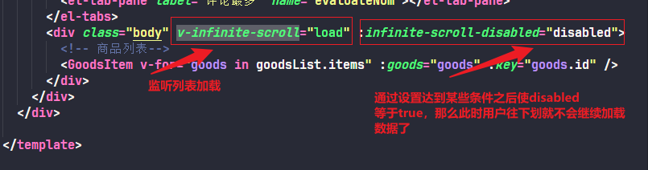
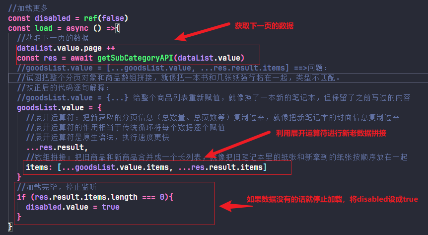

# 澜庭汇vue3+ts电商项目（本质上是小兔鲜电商项目）

### 🚀本项目本地部署与亮点总结

#### 1.部署步骤如下：

##### 1.拉取代码到本地

``` bash
git clone https://github.com/LIU2020822LMC/vue-LanTingHui-shopping-project.git
```

##### 2.进入项目文件夹安装依赖（需要自行下载安装node.js）

```bash
cd vue-LanTingHui-shopping-project
npm install
```

##### 3.启动项目

```bahs
npm run dev
```

##### 4.登录的账号与密码如下：

```bash
账号		     手机号       密码
heima282	12056258282	hm#qd@23!
heima283	12056258283	hm#qd@23!
heima284	12056258284	hm#qd@23!
heima285	12056258285	hm#qd@23!
heima286	12056258286	hm#qd@23!
heima287	12056258287	hm#qd@23!
heima288	12056258288	hm#qd@23!
heima289	12056258289	hm#qd@23!
heima290	12056258290	hm#qd@23!
heima291	12056258291	hm#qd@23!
heima292	12056258292	hm#qd@23!
heima293	12056258293	hm#qd@23!

沙箱新账号 scobys4865@sandbox.com		
登录和支付的密码还是111111			
```

#### 2.项目总结

##### 使用的技术栈有：**axios + vue3 + dayjs + element-plus + pinia + pinia-plugin-persistedstate + vue-router**

##### 1、基于业务的逻辑组件拆分思想

整个项目拆分成十个模块：购物车列表、商品分类、订单详情、商品详情、首页、整体布局、用户登录、会员中心、支付管理、热门商品信息


##### 2、长页面吸顶交互的实现

**使用原因：** 电商平台的页面大部分都很长，如果没有吸顶导航，用户将页面滑动到底部并且想要切换到其他页面时，只能再次将页面滑动到顶部，这种设计是很不友好的。有了吸顶导航后，用户可以随时点击吸顶导航进行页面切换。

**基本思想：** 浏览器在上下滑动的过程中，如果距离顶部的滚动距离大于某个值，就让固定的导航栏显示出来，小于这个值则隐藏。

未超过设定的距离顶部的值时显示的头部页面是这样子的：


超过了之后显示是这样子的：


**实现过程：**

准备LayoutFixed组件与LayoutHeader组件，这两个组件的模板差不多是一样的，不同的是，LayoutHeader组件是一直显示在顶部的，而LayoutFixed组件则在距离顶部的滚动距离大于设定某个值的时候才会显示出来，并且不会随着滑下去而被其他覆盖掉，就超过设置的距离之后就一直显示在顶部


LayoutFixed组件实现页面吸顶交互详情解释：

首先需要vueuse中的useScroll函数来获取你在页面距离顶部的滚动距离y


当y>78px的时候，添加show类名show类名里面有个opacity的属性


show类名里面有个opacity的属性，当这个属性变为1的时候，让这个组件显示出来


通过设置 “position: fixed;” 来实现，无论用户如何滚动页面，导航栏都一直显示在屏幕的特定位置。这样子就无论你往下滚动多少就一直显示在顶部


##### 3、自定义图片懒加载指令并封装为插件

**使用原因：** 电商平台项目有大量的商品图片, 同时加载和渲染全部的图片资源会挤占带宽, 首页白屏与加载时间过长,用户体验感不好, 同时还会浪费用户的流量，有些用户并不想全部看完，全部加载会耗费大量流量。所以需要使用到图片懒加载。将懒加载指令封装为插件是为了方便在项目各个组件中的使用。

**实现逻辑：** 
（1）懒加载：只有当图片出现在视口区域才会发送图片的网络请求，将图片的src替换成接口返回的图片地址。

（2）封装插件：使用app将指令封装成插件，然后再入口文件main.js文件中注册

**实现过程：**

通过useIntersectionObserver函数中isIntersecting属性判断图片是否进入视口区，如果达到标准则会向接口请求图片资源链接将其放在img中的src里


设置 rootMargin，提前80px开始加载图片


将指令注册为插件：在main.ts文件中引入图片懒加载指令所在文件（即@/directives/index），然后通过app实例注册为全局指令，这样子就可以在其他组件使用img-lazy这个指令了


在组件使用的时候需要写成v-img-lazy这样子的形式


##### 4、封装复用组件

**使用原因：** 在电商项目中，很多模块在结构上非常相似，只是内容不同，通过组件封装可以实现复用结构的效果。

**基本思想：** 把可复用的结构只写一次，把可能发生变化的部分抽象成组件参数（props/插槽）

比如说下面精选好货模块与人气推荐模块，他们机构都是相同的，只有数据是不一样的，所以只把相同的部分取出来，数据从父组件通过接口获取，然后再通过props传递给复用的组件，复用的组件再将他们渲染出来


基于上面的思想就创造出HomePanel组件作为复用的组件


下面是精选好货模块与人气推荐模块使用复用组件的方法


除了以上两个模块之外，还有一个HomeProduct组件也用到了这个复用组件


除了HomePanel组件时复用组件之外，还有一个GoodsItem组件也是复用组件，并且这个组件我将其全局注册（在main.ts文件进行全局注册），就是说，你在其他组件使用的时候直接<GoodsItem />就可以使用，不需要再import导入


以下是使用GoodsItem复用组件的例子

在src\views\Category\index.vue组件使用：


在src\views\Home\components\HomeProduct.vue组件使用：


在src\views\Member\components\userInfo.vue组件使用：


在src\views\SubCategory\index.vue组件使用：


##### 5、在package.json文件中的scripts的dev指令添加 --open

本来是"dev": "vite"改成"dev": "vite --open"，添加的作用是当你启动项目的时候，即命令行运行pnpm run dev或者npm run dev的时候，一旦加载完成会立刻打开默认浏览器打开网站


运行完毕之后不需要手动打开网址，直接自己打开


##### 6、通用逻辑函数的封装

**封装原因：** 在项目中通常会有一些通用的函数，比如小兔鲜项目中的轮播图部分，将重复使用的代码块封装成独立的函数，这样在需要时可以直接调用这些函数，避免了重复编写相同的代码，提高了代码的复用性‌，同时降低模块之间的耦合度。

**基本思想：** 将通用的逻辑函数拿出来封装到独立的js文件中，使用export将函数导出去，在函数内部使用return将需要用的数据或方法return出去

比如在src\views\Category\composables\useBanner.ts文件封装的轮播图相关逻辑函数


结合接口文档封装轮播图接口，配置相关的配置。 点击-->[轮播图接口地址](https://s.apifox.cn/c05cb8d7-e591-4d9c-aff8-11065a0ec1de/api-67132166)


接口所需要的参数以及地址


接口返回的数据，尤其是result里面的imgUrl数据，这个是关键，需要获取这个渲染到页面上实现轮播图的效果


在src\views\Category\index.vue组件中引入函数，并把要使用的数据和方法解构出来




使用element-plus里面提供的走马灯组件配合接口返回的图片数据实现轮播图效果


##### 7、列表无限加载

**使用原因：** 日常使用的电商平台的商品列表页中会有大量的商品内容，一般来说用户是很难滑倒列表的底部的，也就是说电商平台的商品列表一般是无限加载的。

**基本思想：** 监听用户是否划到了列表底部，是的话就请求新的商品数据，把新的商品数据和旧的商品数据拼接在一起渲染

使用elementPlus提供的v-infinite-scroll指令监听用户是否列表是否满足触底条件


结合elementPlus可以知道，v-infinite-scroll指令的意思是，当用户滚到底部的时候会触发load函数




在src\views\SubCategory\index.vue组件使用这个指令达到列表无限加载的效果



如果满足就让请求的页数参数加1获取下一页的数据，然后将新数据和老数据做拼接渲染，当没有数据可以获取时，就使用infinite-scroll-disabled指令禁止列表加载,也就是说，当用户没有往下划的时候就发送参数dataList.value.page=1就可以了，不用请求那么多次造成服务器负担，只有用户往下滑动时才会改变参数继续继续向后端发送请求获取数据




##### 8、路由缓存问题的处理

**使用原因：** 使用带有参数的路由时，当用户从／users／johnny 导航到／users／jolyne（eg.从／users／1 导航到／users／2） 时，相同的组件实例将被重复使用。因为两个路由都渲染同个组件，比起销毁再创建，复用则显得更加高效。不过，这也意味着组件的生命周期钩子不会被调用，数据不会更新。因为组件被重用，组件不会被销毁再创建，所以 setup/onMounted 不会再次运行，页面不会自动重新请求新 id 的数据。

**实现方案：** 使用onBeforeRouteUpdate导航钩子，onBeforeRouteUpdate 是在路由参数变化、组件将被“更新路由”时触发的组件内导航守卫，适合在这里重新发起接口请求并更新组件状态，保证页面展示新参数对应的数据

**实现的过程流程：** 当你首次访问/category/1005000时，Router创建组件实例，跳转到src\views\Category\index.vue组件 → setup/run onMounted → 调用getCategory(1005000) → 填充categoryData →视图渲染。


后面当你访问/category/1005002时（同一组件、不同params），setup/run onMounted这一步骤不会再次执行，也就说不会重新发送新参数的请求，这个时候就要借助onBeforeRouteUpdate函数了，它会检测到你要去的路由跟之前有变化，然后你就可以实现当组件重新渲染之前执行自己设置的回调函数（“被其他函数调用” 的函数），即获取新路由的参数作为getCategory()函数的新参数执行发送新请求获取数据的操作，后面组件渲染出来之后，里面的响应式数据变化触发视图更新，显示/category/1005002的内容


如果不使用onBeforeRouteUpdate（也不使用watch监听），组件不会被调用，页面仍显示旧的categoryData（/category/1005000的内容），用户看到的是“数据未更新”的情况

###### 以上的总结都是根据[小兔鲜项目总结——项目亮点](https://blog.csdn.net/Kong08242022/article/details/143954066)这篇文章来写的

###### 以下的总结是根据[vue3踩坑笔记：电商平台小兔鲜项目回顾与总结](https://www.jianshu.com/p/2d32339526dc)这篇文章来写

### 小兔鲜项目中的亮点：

#### 1、自定义vue指令v-lazy-img

**背景：** 电商平台项目有大量的商品图与详情图, 同时大量加载与渲染图片资源会挤占带宽, 首页白屏与加载时间过长,体验不好, 所以需要使用到图片懒加载。封装成vue指令是为了在项目各文件中更便捷使用。
**原理：** 图片懒加载，当滚动时元素出现在视口中时，才需要src替换成接口返回的图片地址。

在根目录directives创建index.ts文件, 内容如下

```ts
//定义图片懒加载插件
import { useIntersectionObserver } from "@vueuse/core";
import type { App } from 'vue'
import type { DirectiveBinding } from 'vue'

export const ImgLazyPlugin = {
  install(app: App){
    //定义全局指令
    app.directive("img-lazy", {
      //“binding: DirectiveBinding<string>”
      // 表示 binding 是一个指令绑定，这里的指令绑定类型是针对字符串类型的数据
      mounted(el: HTMLImageElement, binding: DirectiveBinding) {
        //el : 指令绑定的那个元素 
        //binding：binding.value 指令等于号后面绑定的表达式的值 图片url
        // console.log(el,binding.value)
        // 使用 useIntersectionObserver 监听元素是否进入视口
        const { stop } = useIntersectionObserver(
          el, // 监听的元素
          ([{ isIntersecting }]) => {
            // console.log(isIntersecting)
            // 当元素进入视口时 isIntersecting 为 true
            if (isIntersecting) {
              // 设置图片的 src 属性，开始加载图片
              el.src = binding.value;
              // 停止监听
              stop();
              // 图片加载完成后的处理
              el.onload = () => {
                // 可以在这里添加淡入效果或移除loading状态
                el.style.opacity = "1";
              };
              // 图片加载失败的处理
              el.onerror = () => {
                // 设置默认图片或错误提示
                el.src =
                  "";
              };
            }
          },
          {
            // 设置 rootMargin，提前80px开始加载图片
            rootMargin: "80px",
          }
        );
      },
    });
}
}
```
补充一个概念：视口边界（Viewport Boundary）。指的是浏览器当前可见区域的边缘（上下左右四个边）。简单说，就是你打开网页时，屏幕上能直接看到的那部分区域的边缘

**实现过程：**


**用文字 “画” 个示意图（假设纵向滚动）：**

```plaintext
+------------------------+  ← 实际视口上边缘
|                        |
|     可见区域           |
|                        |
+------------------------+  ← 实际视口下边缘
|                        |
|  （rootMargin扩展的80px范围） ← 这里就是“预警带”
|                        |
+------------------------+  ← 扩展范围的下边缘（实际视口下边缘+80px）
|                        |
|  [图片元素]            |  ← 初始位置（在扩展范围外，不加载）
|                        |
↓ 滚动方向
...
|                        |
|  [图片元素]            |  ← 进入扩展范围（距离实际视口下边缘80px内），触发加载
|                        |
+------------------------+  ← 扩展范围的下边缘
```


main.js文件中引入并注册

```ts
//引入图片懒加载插件
import {ImgLazyPlugin} from "@/directives/index"
app.use(ImgLazyPlugin)
```
#### 2、axios的二次封装

在src\utils\http.ts下面写入如下内容：

```ts
//axios基础的封装
import axios from "axios";
import { ElMessage } from "element-plus";
import { useUserStore } from "@/stores/userStore";
import router from "@/router";

const request = axios.create({
  baseURL: "http://pcapi-xiaotuxian-front-devtest.itheima.net",
  timeout: 50000,
});

//axios请求拦截器
request.interceptors.request.use(
  (config) => {
    //函数（config => { return config }）：请求成功准备发送时会执行。
    //config 是请求的 “配置信息”（比如请求地址、请求头、参数等）。
    //这里 return config 表示 “让请求按原计划发送”（不做修改）。
    //实际开发中，这里经常用来加东西，比如给所有请求加个身份令牌（token）：config.headers.Authorization = 'xxx'，再 return 出去。

    //给所有请求加个身份令牌（token）
    //1.从pinia获取token数据
    const userStore = useUserStore();
    const token = userStore.userInfo?.token;
    //2.按照后端的要求拼接token数据
    if (token) {
      config.headers.Authorization = `Bearer ${token}`;
    }
    return config;
  },
  (e) => Promise.reject(e)
);

//axios响应式拦截器
request.interceptors.response.use(
  //返回res.data是为了只提取响应体数据，让调用方直接拿到业务数据，而不需要每次都response.data
  //实际流程：
  // 1.服务器返回的是已经是JSON格式的数据
  // 2.Axios会自动将JSON响应解析成JavaScript对象
  // 3.拦截器只是帮你把response.data提取出来，省去了每次都要.data的步骤
  // 举个例子：
  //没有拦截器时
  // const response = await request.get('/api/goods')
  // const data = response.data  // 需要手动.data

  // 有拦截器时
  // const data = await request.get('/api/goods')  // 直接拿到数据
  (res) => res.data,
  //统一错误提示
  (e) => {
    ElMessage({
      showClose: true,
      message: e.response.data.message,
      type: "error",
    });
    //401token失效处理
    if (e.response.status === 401) {
      //1.清除本地用户数据
      const userStore = useUserStore();
      userStore.clearUserInfo();
      //2.跳转到登录页
      router.push("/login");
    }
    return Promise.reject(e);
  }
);

export default request;
```
#### 3、持久化本地pinia数据

1、用户数据中有一个关键的数据叫做Token（用来标识当前用户是否登录），而Token持续一段时间才会过期
2、Pinia的存储是基于内存的，刷新就丢失，为了保持登录状态就要做到刷新不丢失，需要配合持久化进行存储
3、有两种方式，本地存储localStorage，以及pinia的插件pinia-plugin-persistedstate

本项目使用pinia的插件pinia-plugin-persistedstate来持久化存储数据


当你在Store里面写入  {persist: true,}之后，pinia-plugin-persistedstate插件就会自动帮你将这个store存储的state进行持久化存储，比如说在src\stores\userStore.ts中，它就会帮你把cartStore与userInfo进行持久化存储，即在浏览器的本地存储空间里当作键值对来存储，键是你定义的这个store的名字，值就是这个store的state数据


#### 4、路由缓存问题，即路由跳转时，页面没有更新

什么是路由缓存问题：使用带有参数的路由时需要注意的是，当用户从／users／johnny 导航到／users／jolyne 时，相同的组件实例将被重复使用。因为两个路由都渲染同个组件，比起销毁再创建，复用则显得更加高效。不过，这也意味着组件的生命周期钩子不会被调用。

本项目采用onBeforeRouteUpdate函数来解决这个问题，即再次更新路由复用组件onMounted生命周期函数不再生效时，onBeforeRouteUpdate函数就会执行里面回调函数，即更新路由发送新的请求获取新数据渲染页面


#### 5、支付流程


在src\views\Pay\index.vue组件写入如下内容（选择要何种方式支付的页面）：

```js
<script setup lang="ts">
import { getOrderAPI, type getOrderResult } from "@/apis/pay"
import { onMounted, ref } from "vue";
import {useRoute } from "vue-router";
import { useCountDown } from "@/components/useCountDown";


const payInfo = ref < getOrderResult | null>(null)
const { start, formatTime } = useCountDown()
const route = useRoute()
const getOrder =   async() =>{
  const res = await getOrderAPI(route.query.id as string)
  payInfo.value = res.result
  start(res.result.countdown)
}

onMounted(()=>{
  getOrder()
})

// 跳转支付地址
//携带订单id以及回调地址跳转到支付地址（get）
const baseURL = 'http://pcapi-xiaotuxian-front-devtest.itheima.net/'
const backURL = 'http://127.0.0.1:5173/paycallback'
const redirectUrl = encodeURIComponent(backURL)
const payUrl = `${baseURL}pay/aliPay?orderId=${route.query.id}&redirect=${redirectUrl}`
</script>


<template>
<div class="xtx-pay-page">
<div class="container">
<!-- 付款信息 -->
<div class="pay-info">
<span class="icon iconfont icon-queren2"></span>
<div class="tip">
<p>订单提交成功！请尽快完成支付。</p>
<p>支付还剩 <span>{{ formatTime }}</span>, 超时后将取消订单</p>
</div>
<div class="amount">
<span>应付总额：</span>
<span>¥{{ payInfo?.payMoney?.toFixed(2) }}</span>
</div>
</div>
<!-- 付款方式 -->
<div class="pay-type">
<p class="head">选择以下支付方式付款</p>
<div class="item">
<p>支付平台</p>
<a class="btn wx" href="javascript:;"></a>
<a class="btn alipay" :href="payUrl"></a>
</div>
<div class="item">
<p>支付方式</p>
<a class="btn" href="javascript:;">招商银行</a>
<a class="btn" href="javascript:;">工商银行</a>
<a class="btn" href="javascript:;">建设银行</a>
<a class="btn" href="javascript:;">农业银行</a>
<a class="btn" href="javascript:;">交通银行</a>
</div>
</div>
</div>
</div>
</template>

<style scoped lang="scss">
.xtx-pay-page {
margin-top: 20px;
}

.pay-info {

background: #fff;
display: flex;
align-items: center;
height: 240px;
padding: 0 80px;

.icon {
font-size: 80px;
color: #1dc779;
}

.tip {
padding-left: 10px;
flex: 1;

p {
&:first-child {
font-size: 20px;
margin-bottom: 5px;
}

&:last-child {
color: #999;
font-size: 16px;
}
}
}

.amount {
span {
&:first-child {
font-size: 16px;
color: #999;
}

&:last-child {
color: $priceColor;
font-size: 20px;
}
}
}
}

.pay-type {
margin-top: 20px;
background-color: #fff;
padding-bottom: 70px;

p {
line-height: 70px;
height: 70px;
padding-left: 30px;
font-size: 16px;

&.head {
border-bottom: 1px solid #f5f5f5;
}
}

.btn {
width: 150px;
height: 50px;
border: 1px solid #e4e4e4;
text-align: center;
line-height: 48px;
margin-left: 30px;
color: #666666;
display: inline-block;

&.active,
&:hover {
border-color: $LTHColor;
}

&.alipay {
background: url(https://cdn.cnbj1.fds.api.mi-img.com/mi-mall/7b6b02396368c9314528c0bbd85a2e06.png) no-repeat center /
contain;
}

&.wx {
background: url(https://cdn.cnbj1.fds.api.mi-img.com/mi-mall/c66f98cff8649bd5ba722c2e8067c6ca.jpg) no-repeat center /
contain;
}
}
}</style>
```

支付成功后返回的页面写在src\views\Pay\PayBack.vue组件上，内容如下：

```js
<script setup lang="ts">
import { getOrderAPI, type getOrderResult } from "@/apis/pay"
import { useRoute } from "vue-router";
import { onMounted, ref } from "vue";


const payInfo = ref<getOrderResult | null>(null)

const route = useRoute()
const getOrder = async () =>{
  const res = await getOrderAPI(route.query.id as string)
  payInfo.value = res.result

}

onMounted(()=>{
  getOrder()
})
</script>


<template>
  <div class="xtx-pay-page">
    <div class="container">
      <!-- 支付结果 -->
      <div class="pay-result">
        <!-- 路由参数是字符串而不是布尔值 -->
        <span class="iconfont icon-duihao2 green" v-if="$route.query.payResult === 'true'"></span>
        <span class="iconfont icon-chahao red" v-else></span>
        <p class="tit">支付{{ $route.query.payResult === 'true' ? '成功' : '失败' }}</p>
        <p class="tip">我们将尽快为您发货，收货期间请保持手机畅通</p>
        <p>支付方式：<span>支付宝</span></p>
        <p>支付金额：<span>¥{{ payInfo?.payMoney }}</span></p>
        <div class="btn">
          <el-button type="primary" style="margin-right:20px" @click="$router.push('/cartList')">查看订单</el-button>
          <el-button @click="$router.push('/')">进入首页</el-button>
        </div>
        <p class="alert">
          <span class="iconfont icon-tip"></span>
          温馨提示：小兔鲜儿不会以订单异常、系统升级为由要求您点击任何网址链接进行退款操作，保护资产、谨慎操作。
        </p>
      </div>
    </div>
  </div>
</template>

<style scoped lang="scss">
.pay-result {
  padding: 100px 0;
  background: #fff;
  text-align: center;
  margin-top: 20px;

  >.iconfont {
    font-size: 100px;
  }

  .green {
    color: #1dc779;
  }

  .red {
    color: $priceColor;
  }

  .tit {
    font-size: 24px;
  }

  .tip {
    color: #999;
  }

  p {
    line-height: 40px;
    font-size: 16px;
  }

  .btn {
    margin-top: 50px;
  }

  .alert {
    font-size: 12px;
    color: #999;
    margin-top: 50px;
  }
}
</style>
```

#### 6、定制路由滚动行为

当切换路由时，页面自动滚动到顶部，在router文件中进行配置


#### 7、手动实现导航组件的吸顶展示功能

**需求背景：**当首页页面过长时，使用吸顶效果，使得用户在滑动读取数据的时候把导航条一直固定在屏幕上方，以便用户快速操作和交互。
**逻辑实现：**vueuse中的获取滚动距离顶部的y轴参数，当滚动距离大于78（页面header部分的高度）时，添加show类名，实现吸顶效果


**关键样式：**

```css
.app-header-sticky {
  width: 100%;
  height: 100px;
  //通过设置 “position: fixed;” 来实现，无论用户如何滚动页面，导航栏都一直显示在屏幕的特定位置。
  position: fixed;
  left: 0;
  top: 0;
  z-index: 999;
  background-color: #fff;
  border-bottom: 1px solid #e4e4e4;
  // 此处为关键样式!!!
  // 状态一：往上平移自身高度 + 完全透明
  //translateY 是控制元素在垂直方向移动的属性。
  //-100% 表示 “向上移动自身高度的 100%”（比如元素高 80px，就向上移 80px）。
  transform: translateY(-100%);
  //控制元素的透明度，0 表示完全透明（即使元素在屏幕里，也看不见）
  opacity: 0;

  // 状态二：移除平移 + 完全不透明
  &.show {
    transition: all 0.4s linear;
    /* 动画过渡：所有变化在0.4秒内完成 */
    transform: none;
    /* 取消移动（回到原来的位置） */
    opacity: 1;
    /* 完全不透明（可见） */
  }
}
```
#### 8、商详页，图片预览组件的小图切换大图与放大镜效果

在src\components\ImageView\index.vue组件写入如下代码：

```js
<script setup lang="ts">
import { useMouseInElement } from '@vueuse/core'
import { ref, watch } from 'vue'

// props适配图片列表
defineProps({
  imageList: {
    // 为 imageList prop 添加了明确的类型定义，要声明这个数组是什么类型的
    type: Array as () => string[],
    default: () => []
  }
})


//1.小图切换成大图显示
const activeIndex = ref(0)

const enterHandler = (i: number) => {
  activeIndex.value = i
}

//2.获取鼠标相对位置
const target = ref(null)
const { elementX, elementY, isOutside } = useMouseInElement(target)

//3.控制滑块跟随鼠标移动（监听elementX/Y变化，一旦变化 重新设置left/top）
const left = ref(0)
const top = ref(0)

const positionX = ref(0)
const positionY = ref(0)
watch([elementX, elementY,isOutside], () => {
  //以下的逻辑实现有点复杂，需要时间思考思考
  // console.log('xy变化了');
  if(isOutside.value) return
  // console.log('后续逻辑执行了');
  //有效范围内控制滑块距离
  //横向
  // 鼠标在100-300之间，滑块就跟着鼠标走
  if (elementX.value > 100 && elementX.value < 300) {
    // 让滑块中心对准鼠标，left.value=滑块横向移动的距离
    left.value = elementX.value - 100
  }
  //纵向
  if (elementY.value > 100 && elementY.value < 300) {
    top.value = elementY.value - 100
  }
  //处理边界
  if (elementX.value > 300) { left.value = 200 }
  if (elementX.value < 100) { left.value = 0 }

  if (elementY.value > 300) { top.value = 200 }
  if (elementY.value < 100) { top.value = 0 }

  //控制大图显示
  //大图移动的方向和滑块相反，而且移动距离是2倍
  positionX.value = -left.value * 2
  positionY.value = -top.value * 2
})
</script>


<template>
  <!-- {{ elementX }},{{ elementY }},{{ isOutside }} -->
  <div class="goods-image">
    <!-- 左侧大图-->
    <div class="middle" ref="target">
      
      <!-- 蒙层小滑块 -->
      <div class="layer" v-show="!isOutside" :style="{ left: `${left}px`, top: `${top}px` }"></div>
    </div>
    <!-- 小图列表 -->
    <ul class="small">
      <!-- 当鼠标指针进入（移动到）绑定该指令的 HTML 元素时，会触发名为enterHandler的函数 -->
      <!-- :class="{active:i === activeIndex}"==>当鼠标移动到哪个图，哪个图就使用这个类名 -->
      <li v-for="(img, i) in imageList" :key="i" @mouseenter="enterHandler(i)" :class="{ active: i === activeIndex }">
        
      </li>
    </ul>
    <!-- 放大镜大图 -->
    <div class="large" :style="[
      {
        backgroundImage: `url(${imageList[activeIndex]})`,
        backgroundPositionX: `${positionX}px`,
        backgroundPositionY: `${positionY}px`,
      },
    ]" v-show="!isOutside"></div>
  </div>
</template>

<style scoped lang="scss">
.goods-image {
  width: 480px;
  height: 400px;
  position: relative;
  display: flex;

  .middle {
    width: 400px;
    height: 400px;
    background: #f5f5f5;
  }

  .large {
    position: absolute;
    top: 0;
    left: 412px;
    width: 400px;
    height: 400px;
    z-index: 500;
    box-shadow: 0 0 10px rgba(0, 0, 0, 0.1);
    background-repeat: no-repeat;
    // 背景图:盒子的大小 = 2:1 将来控制背景图的移动来实现放大的效果查看 background-position
    background-size: 800px 800px;
    background-color: #f8f8f8;
  }

  .layer {
    width: 200px;
    height: 200px;
    background: rgba(0, 0, 0, 0.2);
    // 绝对定位 然后跟随咱们鼠标控制left和top属性就可以让滑块移动起来
    left: 0;
    top: 0;
    position: absolute;
  }

  .small {
    width: 80px;

    li {
      width: 68px;
      height: 68px;
      margin-left: 12px;
      margin-bottom: 15px;
      cursor: pointer;

      &:hover,
      &.active {
        border: 2px solid $LTHColor;
      }
    }
  }
}
</style>
```
**实现流程：**

##### 1、小图切换大图的实现

（1）数据层面

- 定义了 activeIndex（响应式变量），用于记录「当前被选中的小图索引」，默认值为 0（默认显示第一张图）。
- 接收父组件传入的 imageList 数组（存储所有图片的地址），小图和大图都从这个数组中取图。


（2）交互层面

- 小图列表通过 v-for 循环 imageList 渲染，每个小图的```<li>```绑定了 @mouseenter="enterHandler(i)" 事件：当鼠标移入某个小图时，会触发 enterHandler 函数，并传入当前小图的索引 i。

- enterHandler 函数的逻辑很简单：把 activeIndex 的值更新为当前小图的索引 i（即 activeIndex.value = i）


(3) 视图层面

- 左侧大图的 `````` 标签通过 :src="imageList[activeIndex]" 动态绑定图片地址：当 activeIndex 变化时，大图的 src 会自动切换为 imageList 中对应索引的图片，实现「小图切换大图」的效果。

- 小图的 ```<li>``` 还通过 :class="{ active: i === activeIndex }" 绑定了高亮样式：当某个小图的索引 i 和 activeIndex 相等时，会添加 active 类（比如边框高亮），提示用户当前选中的是哪张图。


小图转成大图是因为包容图片的容器标签样式改变了


##### 2、放大镜效果的实现

**核心思路：** 通过「跟踪鼠标在原图上的位置」，控制「滑块位置」和「放大区域的显示内容」，模拟放大镜效果。


#### 9、在路由页面，使用导航守卫，配置路由跳转前后的行为