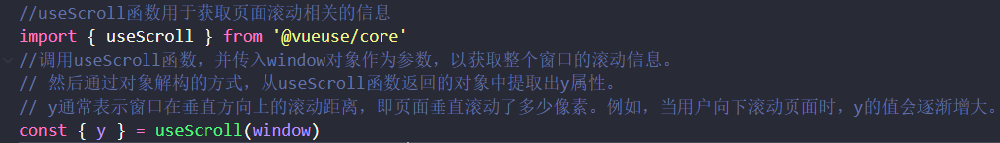
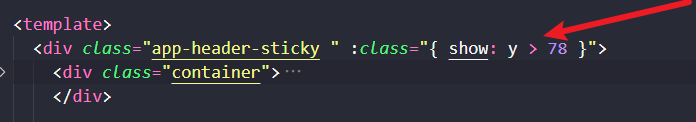
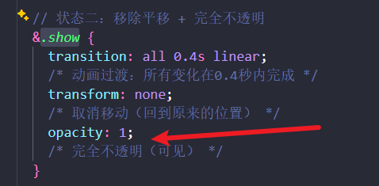
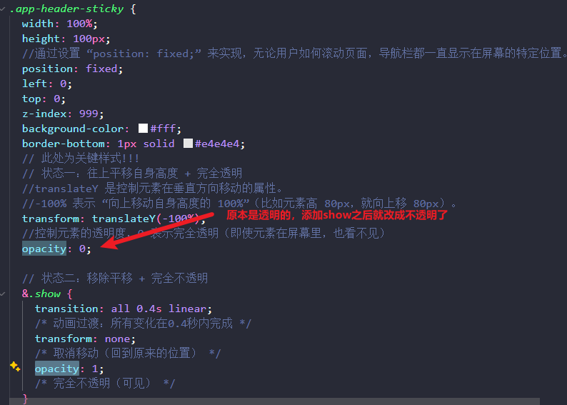
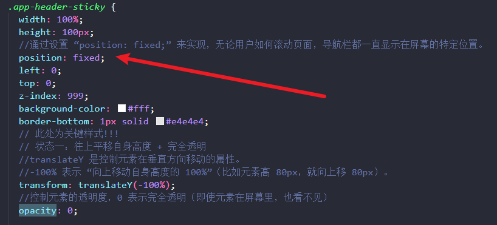

# 澜庭汇vue3+ts电商项目（本质上是小兔鲜电商项目）

### 🚀本项目本地部署与亮点总结

#### 1.部署步骤如下：

##### 1.拉取代码到本地

``` bash
git clone https://github.com/LIU2020822LMC/vue-LanTingHui-shopping-project.git
```

##### 2.进入项目文件夹安装依赖

```bash
cd vue-LanTingHui-shopping-project
npm install
```

##### 3.启动项目

```bahs
npm run dev
```

##### 4.登录的账号与密码如下：

```bash
账号		     手机号       密码
heima282	12056258282	hm#qd@23!
heima283	12056258283	hm#qd@23!
heima284	12056258284	hm#qd@23!
heima285	12056258285	hm#qd@23!
heima286	12056258286	hm#qd@23!
heima287	12056258287	hm#qd@23!
heima288	12056258288	hm#qd@23!
heima289	12056258289	hm#qd@23!
heima290	12056258290	hm#qd@23!
heima291	12056258291	hm#qd@23!
heima292	12056258292	hm#qd@23!
heima293	12056258293	hm#qd@23!

沙箱新账号 fukuvb7569@sandbox.com			
登录和支付的密码还是111111			
```

#### 2.项目总结

##### 使用的技术栈有：**axios + vue3 + dayjs + element-plus + pinia + pinia-plugin-persistedstate + vue-router**

##### 1、基于业务的逻辑组件拆分思想

整个项目拆分成十个模块：购物车列表、商品分类、订单详情、商品详情、首页、整体布局、用户登录、会员中心、支付管理、热门商品信息


##### 2、长页面吸顶交互的实现

**使用原因：** 电商平台的页面大部分都很长，如果没有吸顶导航，用户将页面滑动到底部并且想要切换到其他页面时，只能再次将页面滑动到顶部，这种设计是很不友好的。有了吸顶导航后，用户可以随时点击吸顶导航进行页面切换。

**基本思想：** 浏览器在上下滑动的过程中，如果距离顶部的滚动距离大于某个值，就让固定的导航栏显示出来，小于这个值则隐藏。

未超过设定的距离顶部的值时显示的头部页面是这样子的：


超过了之后显示是这样子的：


**实现过程：**

准备LayoutFixed组件与LayoutHeader组件，这两个组件的模板差不多是一样的，不同的是，LayoutHeader组件是一直显示在顶部的，而LayoutFixed组件则在距离顶部的滚动距离大于设定某个值的时候才会显示出来，并且不会随着滑下去而被其他覆盖掉，就超过设置的距离之后就一直显示在顶部


LayoutFixed组件实现页面吸顶交互详情解释：

首先需要vueuse中的useScroll函数来获取你在页面距离顶部的滚动距离y



当y>78px的时候，添加show类名show类名里面有个opacity的属性



show类名里面有个opacity的属性，当这个属性变为1的时候，让这个组件显示出来





通过设置 “position: fixed;” 来实现，无论用户如何滚动页面，导航栏都一直显示在屏幕的特定位置。这样子就无论你往下滚动多少就一直显示在顶部



##### 3、自定义图片懒加载指令并封装为插件